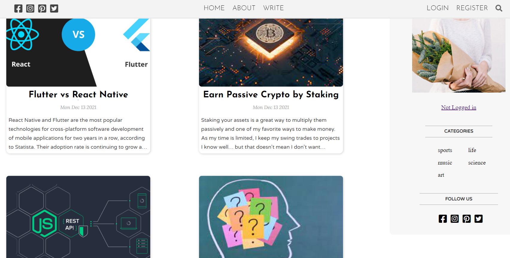
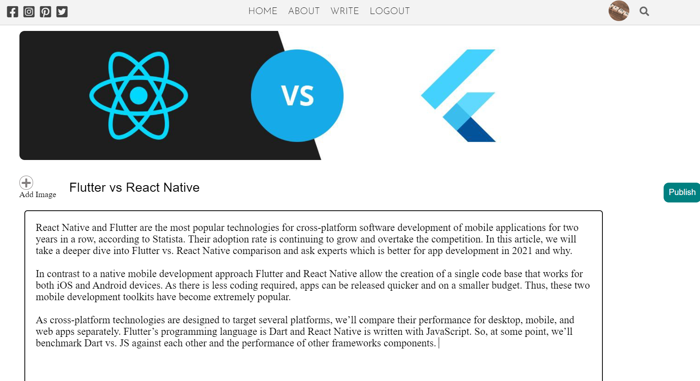

# Bloggy
   <b>Frontend Repository : </b> https://github.com/harshgupta1249/Bloggy-Frontend  
   <kbd></kbd>
      
   <kbd></kbd>

 

# Project Description

A new world in the existing world of Blogs. This project aims at providing a platform for free and easy interaction with the Blogs.  Users just simply need to Register themselves and can start reading pre-existing blogs.They can also write their own Blogs, add images and create their online presence. You can easily update your profile settings and picture and stay up to date.  

 
<kbd></kbd>
 

# Features Implemented

## 1. Frontend

1. Landing Page for social links and Site intro.
2. Login and SignUp page for auth.
3. User Homepage
4. Blog Writing Page
5. User spcific Blogs page
6. User Settings
7. Single Blog Post

## 2. Backend

1. Auth Routes:
   - SignUp
   - Login
   - Password Hash (Using BCrypt)
2. User Routes:
   - Get User details
   - Update User
   - Delete User
3. Post Routes:
   - Create Blog
   - Get All Blogs
   - Update Blog
   - Get Specific Blog
   - Delete Blog
3. Categories Routes:
   - Create Categories
   - Add Categories
 

# Technologies and Packages Used

## 1. Frontend

1. React
2. React-router
3. Axios
4. Multer (to store Images)
5. CSS

## 2. Backend

1. Node
2. Express
3. MongoDB
4. Mongoose
5. Bcryptjs
6. Context API
7. Path
